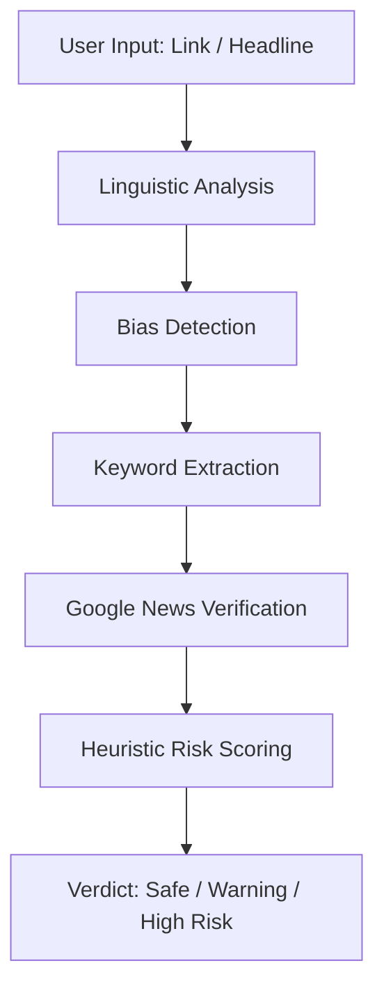

# CODA

### An Explainable AI Framework for Detecting Psychological Manipulation in Digital News

CODA is an AI-powered verification framework designed to examine digital news not only for factual credibility, but also for psychological influence embedded within language.

In digital spaces, misinformation often spreads not because every fact is false, but because language is intentionally structured to trigger urgency, fear, outrage, or emotional reaction before critical thinking begins.

CODA approaches misinformation as both a linguistic and cognitive problem.

Rather than functioning as a black-box fake news detector, the system identifies visible psychological signals in text and combines them with live verification through global news sources.

---

## System Flow

---

## What CODA does

A user submits a headline, statement, or article link.

The system then:

* performs rule-based linguistic analysis
* detects urgency cues, sensational expressions, and emotional framing
* identifies manipulation-oriented language patterns
* extracts keywords from the content
* queries multiple global news sources through Google News RSS
* compares source overlap for informational support

Based on this combined evidence, CODA produces:

* **Safe** → low manipulation signals + strong source verification
* **Warning** → moderate indicators or partial verification
* **High Risk** → strong manipulation signals + weak verification

The output includes both a confidence score and an explanation of detected indicators.

---

## Why this project was built

Human beings do not process every piece of information through slow rational analysis.

Instead, the brain uses cognitive shortcuts — heuristics — to interpret information quickly.

This creates vulnerability.

Words such as *breaking*, *urgent*, *before it disappears*, or strong emotional punctuation influence perception before evidence is examined.

CODA is built around this psychological layer of misinformation.

It does not simply ask whether content is true or false.

It asks:

**Is the language trying to influence reaction before verification happens?**

---

## Detection Logic

| Indicator             | Interpretation                                |
| --------------------- | --------------------------------------------- |
| Urgency Words         | Artificial pressure or fear trigger           |
| Emotional Framing     | Language designed to provoke reaction         |
| Sensational Tone      | Exaggerated impact language                   |
| Personal Trigger Cues | Language targeting direct emotional attention |
| Emoji Intensity       | Attention amplification signals               |
| Verification Match    | Presence across trusted sources               |

---

## Explainability Layer

A major goal of CODA is transparency.

Many misinformation systems generate predictions without showing why a result was produced.

CODA explains:

* which linguistic features triggered concern
* how verification influenced confidence
* why a verdict was assigned

This makes the system interpretable and easier to trust.

---

## Verification Layer

Linguistic analysis alone is not enough.

CODA also performs live verification by querying Google News RSS feeds using extracted keywords.

If multiple trusted sources discuss similar content, credibility increases.

If manipulation signals are strong while verification remains weak, risk increases.

---

## Tech Stack

* Python
* Flask
* HTML
* CSS
* JavaScript
* Regular Expressions
* Google News RSS Integration

---

## Project Structure

* `app.py` → main backend application
* `nlp/` → linguistic and bias analysis modules
* `model/` → heuristic scoring logic
* `templates/` → frontend interface
* `static/` → styling and assets
* `uploads/` → temporary input handling

---

## Future Scope

CODA can evolve into a broader misinformation intelligence framework.

Possible future directions include:

* transformer-based semantic analysis using BERT
* multilingual misinformation detection
* image and deepfake verification
* social media propagation analysis
* bot activity detection
* browser-based instant verification support
* knowledge graph fact validation

---

## Research Background

The project is influenced by explainable AI principles and recent linguistic misinformation research.

Recent studies suggest that linguistic signals significantly improve interpretability in fake news detection systems when combined with machine learning.

CODA adopts this idea by treating language not only as text, but as behavioral evidence.

---

## References

* Google News RSS documentation
* Flask official documentation
* Python Regular Expression documentation
* NIST Explainable AI principles
* IBM Explainable AI overview
* Singh, J., Liu, F., Xu, H., Ng, B. C., & Zhang, W. (2024). *LingML: Linguistic-Informed Machine Learning for Enhanced Fake News Detection*

---

## Citation Sources

* https://www.nist.gov/publications/four-principles-explainable-artificial-intelligence
* https://www.ibm.com/think/topics/explainable-ai
* https://arxiv.org/abs/2405.04165

---

## Developed by
Muskaan Hameed and Paramata Mounish
Muskaan Hameed
Paramata Mounish
